# 帧数据区：JVM

- 类加载子系统
- 运行时数据区
  - 程序计数器
  - 虚拟机栈
  - 本地方法接口
  - 本地方法栈
  - 堆
  - 方法区
  - 直接内存
- 执行引擎
- String Table
- 垃圾回收

## 一、JVM与java体系结构

使用HosSpot VM

### 1. jvm整体结构


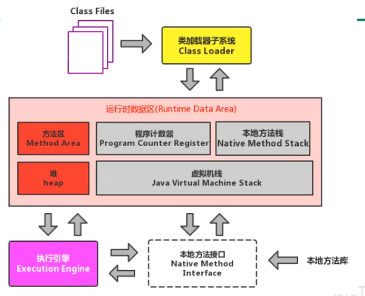


### 2. 架构图

#### 1） jvm整体结构详细图


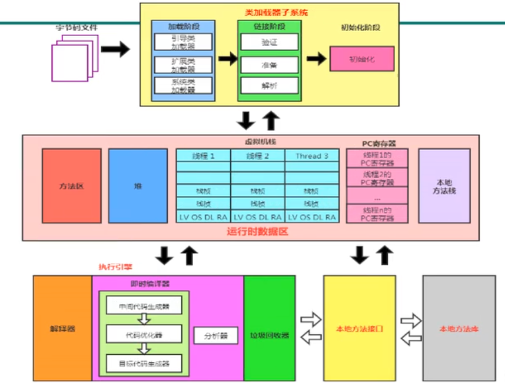

#### 2） jvm架构模型


栈：

跨平台性、指令集小、指令多；执行性能比寄存器差

### 3. jvm生命周期

#### 1） 虚拟机启动

java虚拟机的启动是通过引导类加载器bootstrap class loader创建一个初始类Initial class来完成的，这个类是由虚拟机的具体实现指定的。

object由引导类加载器加载，main由系统类加载器加载的，

#### 2） 虚拟机的执行

- 一个运行中的java虚拟机有着一个清晰的任务：执行java程序。

- 程序开始执行时他才运行，程序结束时他就停止。

- **执行一个所谓的java程序的在，真真正正在执行的是一个叫做java虚拟机的进程。**

#### 3）虚拟机的退出

有如下的集中情况：

- 程序正常执行结束
- 程序在执行过程中遇到了异常或错误而异常终止
- 由于操作系统出现错误而导致java虚拟机进程终止
- 某线成调用Runtime类或System类的exit方法，或Runtime类的halt方法，并且，并且java安全java安全管理器也允许这次exit或halt操作。
- 除此之外，jni规范描述了用jni来加载或卸载java虚拟机时，java虚拟机的退出情况。


### 4. 虚拟机

- 解释器负责响应时间逐行解释，编译器负责执行性能

- sun classic VM 
  - 解释器逐步解释字节码。
  - JIT编译器先编译热点代码会有编译暂停时间。
  - 解释器与JIT编译器无法同时运行。
- Exact VM：
  - Exact Memory Management准却式内存管理
  - 可以知道内存中某个位置的数据具体是什么类型。
  - 热点探测
  - 编译器与解释混合工作模式。
- Hotspot VM *
  - 现在java默认虚拟机
  - 方法区概念
  - 热点代码探测技术
  - 通过计数器找到最具编译价值代码，触发即时编译或栈上替换
  - 通过编译器与解释器协同工作，在最优化的程序响应时间与最佳执行性能中取得平衡
- JRockit *
  - 专注于服务器端应用，不关注程序启动速度，因此没有解释器，全部代码都靠即时编译器编译后执行。
  - 是世界上最快的JVM
  - MissionControl服务套件，以极低的开销来监控、管理和分析生产环境中的应用程序的工具。
- J9 *
- CDC/CLDC Hotspot
  - JavaME的两款虚拟机
- Azul VM
  - 与特定硬件平台绑定、软硬件配合的专有虚拟机
- Liquid VM
  - 不需要操作系统的支持，或者说它自己本身实现了一个专用操作系统的必要功能，如线程调度、文件系统、网络支持等等。
- Apache Harmony
- Microsoft JVM
  - 为了在IE3浏览器中支持Java Applets
- TaobaoJVM
  - 基于OpenJDK开发的定制AlibabaJDK
  - 创新的GCIH（GC invisible heap）技术实现了off-heap，即将生命周期较长的Java对象从heap中移到heap之外，并且GC不能管理GCIH内部的Java对
  - 对象在多个Java虚拟机进程中实现共享
  - 严重依赖intel的cpu。
- Dalvik VM
  - 只能称为虚拟机而不能称为java虚拟机，并未遵循java虚拟机规范
  - 不能直接执行java的class文件
  - 编译后是dex(Dalvik Executable)文件。
  - Android5.0使用支持提前编译（Ahead Of Time Compliation.AOT)的ART VM替换Dalvik VM
- Graal VM
  - 在Hotspot的基础上增强而成的夸语言全栈虚拟机，可以作为“任何语言”的运行平台使用。包括java,scala,groovy,kotlin,c,c++,javascript,ruby,python。、
  - 支持不同语言中混用对方的接和对象，支持这些语言使用已经编写好的本地库文件。


## 二、类加载子系统

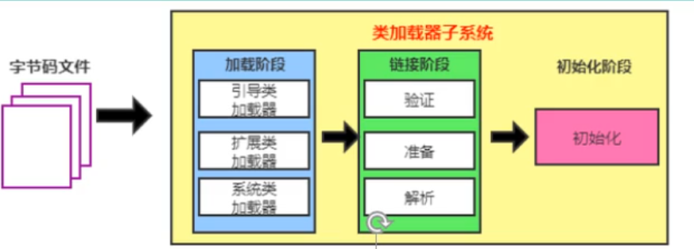


- 类加载器子系统负责从文件系统或网络中加载Class文件，class文件在文件开头有特定的文件标识。
- Class Loader只负责class文件的加载，至于它是否可以运行，则由Execution Engine决定。
- 加载的类信息存放于一块称为方法区的内存空间。除了类的信息外，方法区中还会存放运行时常量池信息，可能还包括字符串字面量和数字常量（这部分常量信息是Class文件中常量池部分的内存映射）

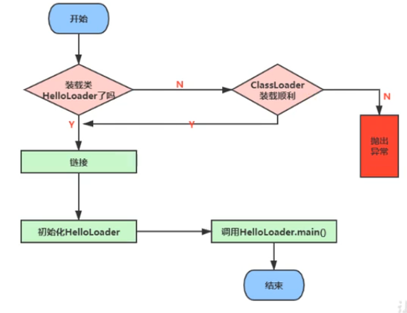


### 1.类的加载过程

加载=>验证=>准备=>解析=>初始化

#### 1）加载loading

1. 通过一个类的全限定名获取定义此类的二进制字节流。
2. 将这个字节流所代表的静态存储结构转化为方法区的运行时数据结构。
3. **在内存中生成一个代表这个类的java.lang.Class对象**，作为方法区这个类的各种数据的访问入口。

补充：加载.class文件的方式

- 从本地系统中直接加载
- 通过网络获取，典型场景：Web Applet
- 从zip压缩包中，成为日后jar、war格式的基础
- 运行时计算生成，使用最多的是：动态代理技术
- 由其他文件生成，典型场景：jsp应用
- 从专有数据库中提起.class文件，比较少见
- 从见密文件中获取，典型的防Class文件被反编译的保护措施

#### 2）链接linking

##### ① 验证 Verify

JClassLib和Binary Viewer

以CAFEBABE开头

主要包括四种验证，文件格式验证，元数据验证，字节码验证，符号引用验证。

##### ② 准备 Prepare  

- 为类变量分配内存并且设置该类变量的默认初始值
- 不包含final修饰的static，因为final在编译的时候就会分配了，准备阶段会显式初始化
- 这里不会为实例变量分配初始化，类变量会分配在方法区中，而实例变量是会随着对象一起分配到Java堆中。

##### ③ 解析 Resolve

- 将符号引用转换为直接引用
- 解析操作往往会伴随着JVM在执行完成初始化之后再执行
- 符号引用就是一组符号来描述所引用的目标。直接引用就是直接指向目标的指针、相对偏移量或一个间接定位到目标的句柄。
- 解析动作主要针对类或接口、字段、类方法、接口方法、方法类型等。

#### 3）初始化init

- 初始化阶段就是执行类构造器方法<clinit>()的过程（class init方法）。
- 此方法不需定义，有static代码块或变量赋值时。javac编译器会自动收集生成<clinit>()。 
- 构造器方法中指令按语句在源文件中出现的顺序执行。
- <clinit>()不同于类的构造器。相当于是虚拟机的<init>()
- 若该类具有父类，jvm会保证子类的<clinit>()执行前，父类的<clinit>()已经执行完毕。
- 虚拟机必须保证一个类的<clinit>()方法在多线程下被同步加锁。


语句顺序执行示例

```java
private static int num = 1;

static{
    num = 2;
    number = 20;
}

private static int number = 10;

public static void main(String[]args){
    System.out.println(ClassInitTest.num);//2
    System.out.println(ClassInitTest.number);//10
}
```

对应字节码文件

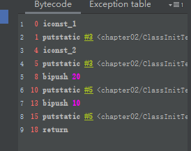

### 2.类加载器的分类

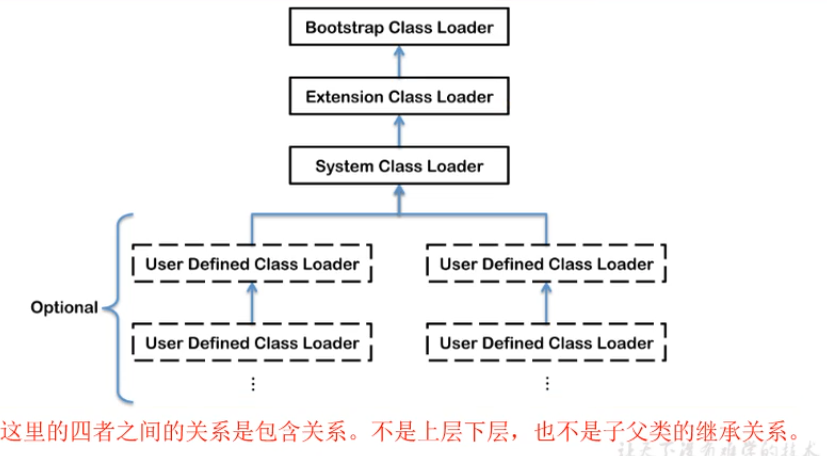


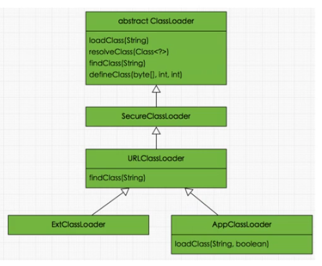

jvm支持的两种加载器

#### 1）引导类加载器(Bootstrap ClassLoader)

- C/C++代码编写
- 用来加载Java的核心库（rt.jar、resources.jar或sun.boot.class.path路径下的内容），用于提供JVM自身需要的类
- 并不继承自java.lang.ClassLoader，没有父加载器
- 加载扩展类(ext)和应用程序类加载器(app)，并指定为他们的父类加载器。
- bootstrap启动类加载器只加载包名为java、javax、sun等开头的类

#### 2）自定义类加载器(User-Defined ClassLoader)

Java代码编写

将所有派生于抽象类ClassLoader的类加载器都划分为自定义类加载器。

##### ① Extension Class Loader 扩展加载器

- java语言编写，由sun.misc.Launcher$ExtClassLoader实现。
- 派生于ClassLoader类
- 父类加载器为启动类加载器
- 从java.ext.dirs系统属性所指定的目录中加载类库，或从JDK的安装目录的jre/lib/ext子目录（扩展目录）下加载类库。如果用户创建的JAR放在此目录下，也会自动由扩展类加载器加载。

##### ② App Class Loader 应用加载器

- java语言编写，由sum.miscLauncher$AppClassLoader实现
- 派生于ClassLoader类
- 父类加载器为拓展类加载器(ext)
- 它负责加载环境变量classpath或系统属性java.class.path指定路径下的类库
- 该类加载是程序中默认的类加载器，一般来说，java应用的类都是由它来完成加载
- 通过ClassLoader#getSystemClassLoader()方法可以获取到该类加载器

##### ③ System Class Loader 系统加载器

### 3.用户自定义类加载器

#### 1）为什么要自定义类加载器

- 隔离加载类（防止类冲突）
- 修改类加载的方式
- 扩展加载源（增加class字节码的来源）
- 防止源码泄漏


#### 2）用户自定义加载器实现步骤

- 继承抽象类java.lang.ClassLoader类的方式，实现自己的类加载器。
- 在JDK1.2之前，在自定义类加载器时，总会去继承ClassLoader类并重写loadClass()方法，在JDK1.2之后建议把加载逻辑写在findClass()方法中。
- 可以直接继承URLClassLoader，可以避免自己去编写findClass()方法及其获取字节码流的方式。


### 4.关于ClassLoader

ClassLoader是一个抽象类，其后所有的类加载器都继承自ClassLoader（不包括启动类加载器）。

sun.misc.Launcher它是一个java虚拟机的入口应用。


获取ClassLoader的途径

| 操作                                           | 描述                            |
| ---------------------------------------------- | ------------------------------- |
| clazz.getClassLoader()                         | 获取当前类的ClassLoader         |
| Thread.currentThread().getContextClassLoader() | 获取当前线程上下文的ClassLoader |
| ClassLoader.getSystemClassLoader()             | 获取系统的ClassLoader           |
| DriverManager.getCallerClassLoader()           | 获取调用者的ClassLoader         |


### 5.双亲委派机制

java虚拟机对class文件采用的是按需加载的方式，也就是说当需要使用该类时才会将它的class文件加载到内存生成class对象。而且加载某个类的class文件时，java虚拟机采用的是双亲委派模式，即把请求交由父类处理，它是一种任务委派模式。


#### 1）工作原理

- 如果一个类的加载器收到了类加载请求，它不会自己先去加载，而是把这个请求委托给父类的加载器去执行。
- 如果父类加载器还存在其父类加载器，则进一步向上委托，请求最终达到顶层的启动类加载器
- 如果父类加载器可以完成类加载任务，就成功返回，倘若父类加载器无法完成此加载任务，子加载器才会尝试自己去加载。


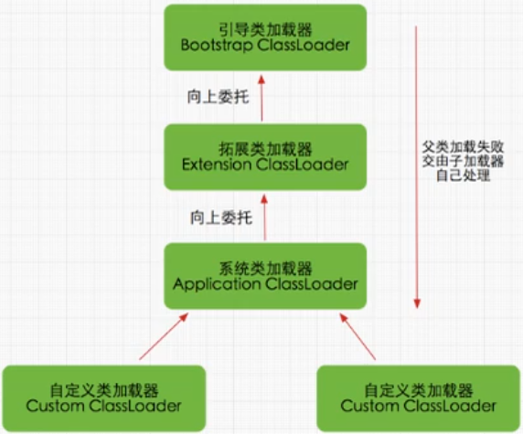


#### 2）例子解释

我们创建一个java.lang包，在里面创建一个String类，并在里面添加一个静态代码块。

```java
package java.lang;
public class String {
    static {
        System.out.println("我是自定义的String类的静态代码块");
    }
}
```

创建一个主方法类

```java
public class StringTest {
    public static void main(String[] args) {
        String str = new String();
    }
}
```

这个时候，因为我创建了一个java.lang.String，而java类库本身就有一个java.lang.String，这个时候运行，猜一下结果是什么？

是输出静态代码块，还是什么都不输出？

答案是：什么都不输出。

为什么这里不会出错呢，为什么这里加载了String，为什么不执行静态代码块呢，看下图。

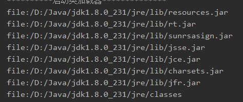


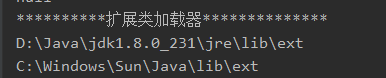

第一张图是启动类加载器可加载的java类库，第二张图是扩展类加载器可加载类库。再看下图的因为使用了双亲委派机制的流程图。

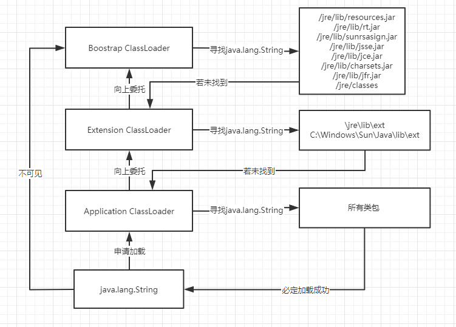

可以看到，当java.lang.String加载时，一直往上委派，直到委派到启动类加载器，因为启动类加载器中可以寻找到java.lang.String，这个时候，启动类加载器就会帮他的下层去完成这个类加载。因为他会到java类库中寻找java.lang.String，所以这个时候加载出来的java.lang.String就不是我们所写的，而是系统类库自带的。

那么我们做实验足以验证这个说法，在String添加main方法并尝试启动

```java
public class String {
    static {
        System.out.println("我是自定义的String类的静态代码块");
    }

    public static void main(String[] args) {

    }
}
```


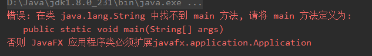

这足以证明，向上委派后，加载的类不是我们所编写的java.lang.String类。

可以看到双亲委派机制的优势

- 避免类的重复加载。

- 保护程序安全，防止核心API被随意篡改

### 6.沙箱安全机制


### 7.其他

在JVM中表示两个cllass对象是否为同一个类存在两个必要条件

- 类的完整类名必须一致，包括包名。
- 加载这个类的ClassLoader必须相同。


JVM必须知道一个类型是由启动加载器加载的还是由用户类加载器加载的。如果一个类型是由用户类加载器加载的，那么JVM会将这个类加载器的一个引用作为类型信息的一部分保存在方法区中。当解析一个类型到另一个类型的引用的时候，JVM需要保证这两个类型的类加载器是相同的。


### 类的主动使用和被动使用

Java程序对类的使用方式分为：主动使用和被动使用。

- 主动使用，又分为七种情况：
  - 创建类的实例

  - 访问某个类或接口的静态变量，或者对静态变量赋值

  - 调用类的静态方法

  - 反射

  - 初始化一个类的子类

  - Java虚拟机启动时被标明为启动类的类

  - JDK7开始提供的动态语言支持：

    java.lang.invoke.MethodHandle实例的解析结果

    REF_getStatic、REF_putStatic、REF_invokeStatic句柄对应的类没有初始化，则初始化。

- 被动使用时，不会导致类的初始化


## 三、运行时数据区

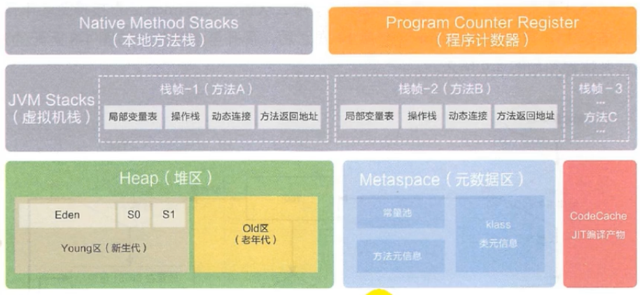


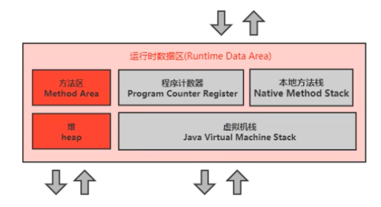

红色区域：进程共享

灰色区域：线程共享


### 1.程序计数器

又叫PC寄存器，用来存储指向下一条指令的地址，也即将要执行的指令代码。由执行引擎读取下一条指令。

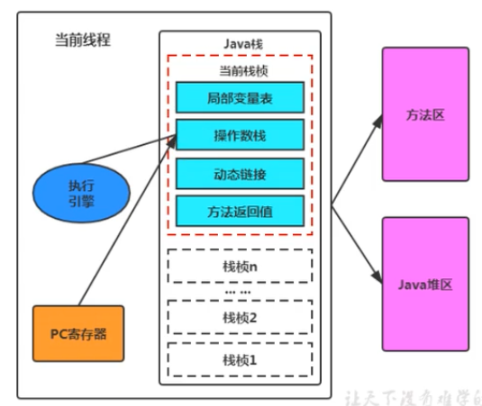

- 很小的内存空间，运行速度最快的存储区域
- 生命周期与线程的生命周期保持一致。
- 任何时间线程中只有一个方法执行，也就是所谓的**当前方法**，程序计数器会存储当前线程正在执行的java方法的JVM指令地址。若执行native方法，则是undefined。
- 是程序控制流的指示器。
- 字节码解释器工作时要通过改变这个计数器的值来选取下一条需要执行的字节码指令。
- 没有规定任何OOM情况的区域。


下列的**指令地址**就是**PC寄存器**中需要存放的值。

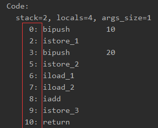

使用PC寄存器的作用：因为CPU需要不停的切换线程，切换回来之后，JVM的字节码解释器就需要通过改变PC寄存器的值来明确下一条应该执行什么样的字节码指令。

PC寄存器为什么设定为线程私有：cpu时间片轮换并发，需要线程切换，在切换其他线程时必然导致中断和恢复线程，每个线程拥有自己的PC寄存器能起到保护执行现场的作用。


### 2.虚拟机栈

栈解决程序的运行问题，堆解决数据存储。

- 线程创建时会创建一个虚拟机栈，其内部保存栈帧

- 是线程私有的
- 生命周期和线程一致

作用：保存方法的局部变量（8种基本类型数据、对象的引用地址）、部分结果、并参与方法的调用和返回。

#### 1）栈的特点

- 访问速度仅次于程序计数器
- JVM对Java栈的操作
  - 每个方法执行，伴随着进栈
  - 执行结束后出栈
- 不存在垃圾回收


#### 2）栈异常

java虚拟机规范允许java栈的大小是动态的或者是固定不变的。

- 如果采用固定大小的java虚拟机栈，如果超过虚拟机栈允许的最大容量，java虚拟机会抛出StackOverflowError异常
- 如果采用动态扩展虚拟机栈，并且在尝试拓展的时候无法申请到足够的内存，会抛出OutOfMemoryError异常。


各系统默认java栈内存大小

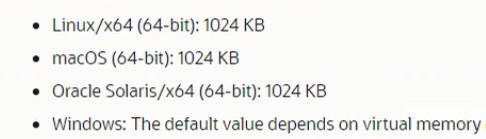

设置栈内存大小-Xss：`-Xss1m`=`-Xss1024k`=`-Xss1048576`


#### 3）栈中的存储

- 栈中存储着栈帧。
- 线程上执行的方法各自对应一个栈帧


#### 4）栈运行原理

- 操作：压栈出栈，遵循先进后出
- 活动线程中，只会有一个活动栈帧，即栈顶栈帧，被称为**当前栈帧**，与当前栈帧对应的方法是**当前方法**，定义这个方法的类是**当前类**
- 执行引擎运行的所有字节码指令只针对当前栈帧进行操作。
- 在方法中调用其他方法，会有新栈帧被创建放在栈顶，成为新的当前帧。
- 不同线程中所包含的栈帧是不允许存在相互引用的。
- 方法返回时，当前栈帧会传回此方法的执行结果给前一个栈帧，接着丢弃当前栈帧，使前一个栈帧重新成为当前栈帧。
- 正常函数return或抛出异常，都会导致栈帧被弹出。


#### 5）栈帧的内部结构

- **局部变量表(Local Variables)**
- **操作数栈(Operand Stack)**
- 帧数据区：动态链接(Dynamic Linking)
- 帧数据区：方法返回地址(Return Address)
- 帧数据区：一些附加信息

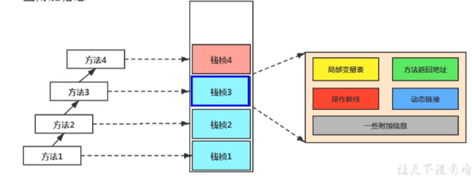

##### ① 局部变量表(Local Variables)

- 局部变量表也称为局部变量数组或本地变量表
- 是一个数字数组，主要用来存储方法参数和定义在方法体内的局部变量，包括基本类型、对象引用地址，以及returnAddress。
-  线程私有数据，不存在数据安全问题
- 局部变量表所需的容量大小是在编译期确定下来的。保存在方法的Code属性的maximum local variables数据项中。运行期间不改变局部变量表的大小
- 方法嵌套调用的次数由栈的大小决定。栈越大，方法嵌套调用次数越多，然而函数的参数和局部变量，局部变量表膨胀，栈帧就越大，其嵌套调用次数就会减少。
- 局部变量表中的变量只在当前方法调用中有效。方法调用结束后，随栈帧销毁而销毁。


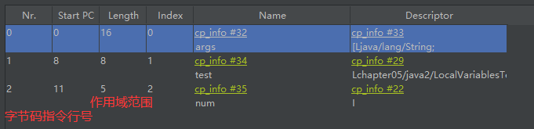


**slot**

- 局部变量表的最基本单位是Slot(变量槽)
- 在局部变量表里，32位以内的类型只占用一个slot（包括returnAddress类型），64位的类型(long和double)占用两个slot。
  - byte、short、char、float在存储前被转换为int,boolean也被转换为int。
  - long和double则占据两个Slot。
- JVM会为局部变量表的每一个Slot都分配一个访问索引。通过索引访问局部变量表指定的局部变量值
- 当一个实例方法被调用，方法参数和方法体内的局部变量会**按照顺序被复制**到局部变量表中的每一个Slot上
- **如果需要访问64bit的局部变量值时，只需要使用前一个索引**
- **如果当前帧是由构造方法或实例方法创建的，那么该对象引用this就会存放在index为0的slot处**(this.对象写法的由来)


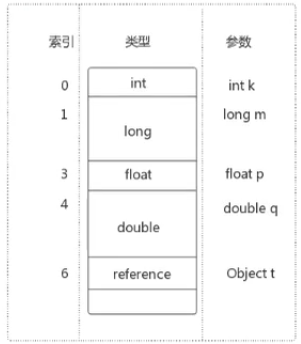

- slot在栈帧中是可以重用的。当一个局部变量过了其作用域，在其作用域后申明的新的局部变量有可能会复用过期局部变量的slot位。

```java
public void test4() {
    int a = 0;
    {
        int b = 0;
        b = a + 1;
    }
    //c会重用b的slot槽位
    int c = a + 1;
}
```

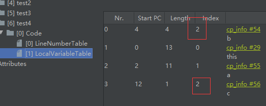

- 在栈帧中，与性能调优关系最为密切，在方法执行时，虚拟机使用局部变量表完成方法的传递。
- 局部变量表中的变量也是重要的垃圾回收根节点，只要被局部变量表中直接或间接引用的对象都不会被回收。


##### ② 操作数栈(Operand Stack)

使用数组实现。也称为**表达式栈(Expression Stack)**

- 在方法执行过程中，根据字节码指令，往栈中写入数据或提取数据，即**入栈/出栈**
- **主要用于保存计算过程的中间结果，同时作为计算过程中变量临时的存储空间。**
- 是JVM执行引擎的一个工作区，当一个方法刚开始执行的时候，一个新的栈帧也会随之被创建出来，**这个方法的操作数栈是空的。**
- 每一个操作数栈都有一个明确的栈深度用于存储数值，就像数组在定义时就已经确定好长度一样，其最大深度在**编译期就定义好了**，保存在方法的Code属性中，为max_stack的值。
- 栈中的任何一个元素都可以是任意的java数据类型。
  - 32bit的类型占用一个栈单位深度。
  - 64bit的类型占用一个栈单位深度。
- **并非采用索引的随机访问**，只能通过标准的**入栈和出栈**操作来完成一次数据访问。
- **调用方法带返回值，返回值将会被压入当前栈帧的操作数栈中**，并更新PC寄存器中下一条需要执行的字节码指令
- 操作数栈中元素的数据类型必须与字节码指令的序列严格匹配，这由编译器在编译期间进行验证，同时在类加载过程中的类检验阶段的数据流分析阶段要再次验证。
- java虚拟机**解释引擎是基于栈的执行引擎**，其中的栈指的就是操作数栈。


**代码追踪**

java代码

```java
public void testAddOperation() {
    //byte、short、char、boolean：都以int型来保存
    byte i = 15;
    int j = 8;
    int k = i + j;
}
```


编译后，javap获取字节码

```java
0: bipush        15
2: istore_1
3: bipush        8
5: istore_2
6: iload_1
7: iload_2
8: iadd
9: istore_3
10: return
```

bipush 15执行后入栈15，istore_1出栈值赋于局部变量表索引为1的位置。执行完这两次命令后栈为空

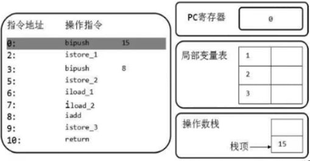


bipush 8执行后入栈15，istore_2出栈值赋于局部变量表索引为2的位置。执行完这两次命令后栈为空

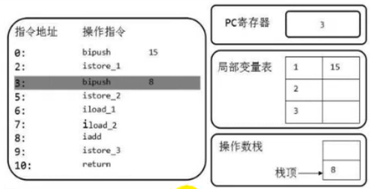


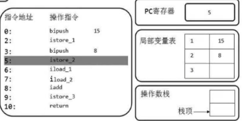


iload_1取出局部变量表中索引为1的值入栈，此时栈顶的值为15。

iload_2取出局部变量表中索引为2的值入栈，此时栈顶的值为8.


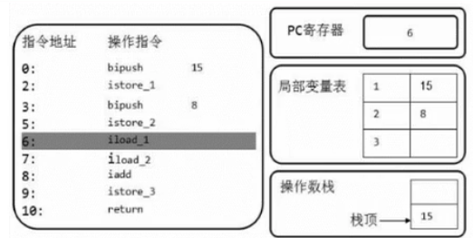


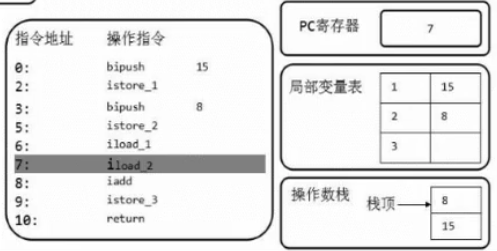


由执行引擎执行iadd从栈中出栈两个两值进行相加后入栈。istore_3从栈顶中取出一个值赋给索引为3的局部变量。此时栈为空。

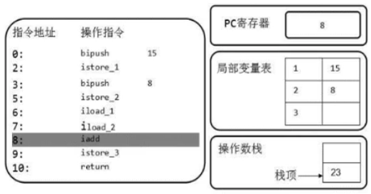

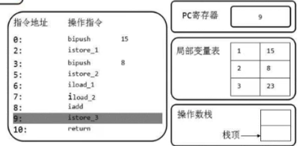

最后return结束。


整个过程中，局部变量表长度为4(加上this)，操作数栈深度为2。=>`stack=2, locals=4`


##### ③ 动态链接(Dynamic Linking)#x

又称指向运行时常量池的方法引用

- 每一个栈帧内部都包含一个指向**运行时常量池**中的**该栈帧所属方法的引用**。目的是为了支持当前方法代码能够实现**动态链接**。比如：invokedynamic指令
- 源文件被编译到字节码文件中时，所有的变量和方法引用都作为符号引用(#x)

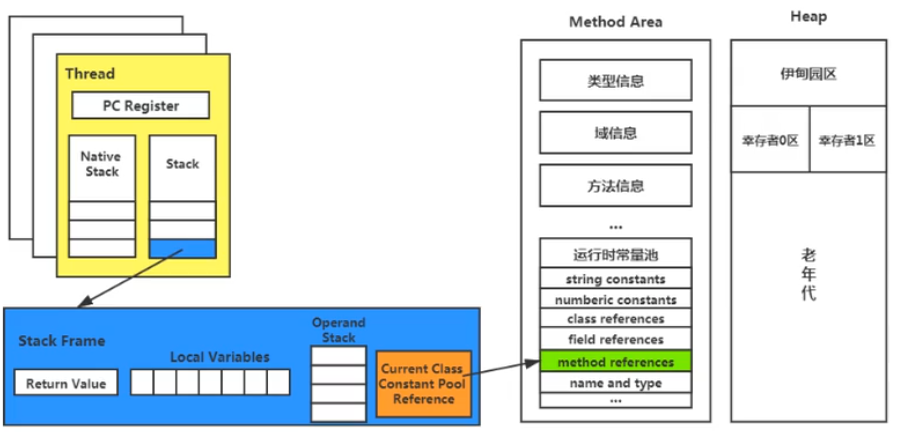


**方法的调用**

将符号引用转换为调用方法的直接引用与方法的绑定机制相关。

- 静态链解接：

  当字节码文件被装载进JVM内部时，如果**被调用的目标方法在编译期可知**，且运行期保持不变时。这种情况下将调用方法的符号引用转换为直接引用的过程称为静态链接。

- 动态链接：

  如果**被调用的方法在编译期无法被确定下来**。在程序运行期将调用方法的符号引用转换为直接引用。

对应的方法绑定机制为：**早期绑定**和**晚期绑定**。**绑定是一个字段、方法或者类在符号引用被替换为直接引用的过程，这仅仅发生一次。**


非虚方法：

- 如果方法在编译期就确定了具体的调用版本，这个版本在运行时是不可变的。这样的方法称为非虚方法。
- 静态方法、私有方法、final方法、实例构造器、父类方法都是非虚方法。
- 其他方法称为虚方法。


方法调用指令：

- 普通调用指令
  - invokestatic：调用静态方法，解析阶段确定唯一方法版本
  - invokespecial：调用<init>方法、私有及方法，解析阶段确定唯一方法版本
  - invokevirtual：调用所有虚方法
  - invokeinterface：调用接口方法
- 动态调用指令：
  - invokedynamic：动态解析出需要调用的方法，然后执行

前四条指另固化在虚拟机内部，方法调用执行不可人为干预，而invokedynamic指令则支持由用户确定方法版本。其中invokestatic指令和invokespeacial指令调用的方法称为非虚方法，其余的（final修饰的除外）称为虚方法。


重写本质：

1. 找到操作数栈顶的第一个元素所执行的对象实际类型，记作C。
2. 如果在类型C中找到与常量中的描述符合简单名称都相符的方法，则进行访问权限校验，如果通过则这个方法的直接引用，查找过程结束：如果不通过，则返回java.lang.IllegalAccessError异常。
3. 否则，按照继承关系从下往依次对C的各个父类进行第2步的搜索和验证过程。
4. 如果始终没有找到合适的方法，则抛出java.lang.AbstractMethodError异常。

在上面写到的重写本质中其实就是虚方法的查找，为了提高性能，**jvm采用在类的方法区建立一个虚方法表使用索引表来代替查找**

- 每个类中都有一个虚方法表，表中存放着各个方法的实际入口。
- 虚方法表会在类加载的**链接阶段(解析Resolve)**被创建并开始初始化，类的变量初始值准备完成之后，JVM会把该类的方法表也初始化完毕。


举例一：在Son与Father都继承Object类，Son继承Father时，他们两个都会继承Object的方法。Son重写了从Father里继承的两个方法。重写方法之后指向Son类自身的方法，如果Son并未重写方法，直接引用就会指向Father的方法。

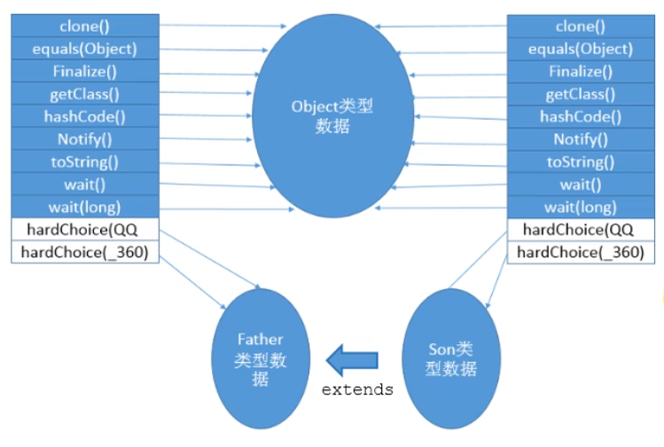


举例二：

```java
interface Friendly{
    void sayHello();
    void sayGoodbye();
}
class Dog{
    
    public void sayHello(){}
    
    @Override
    public String toString(){
        return "Dog";
    }
}
class Cat implements Friendly{
    
    public void eat(){}
    
    @Override
    public void sayHello() {}
    
    @Override
    public void sayGoodbye() {}
    
    @Override
    protected void finalize(){}
    
    @Override
    public String toString() {
        return super.toString();
    }
}
class CockerSpaniel extends Dog implements Friendly{
    public void sayHello(){
        super.sayHello();
    }
    @Override
    public void sayGoodbye() {}
}
```

**Dog类的虚方法表**

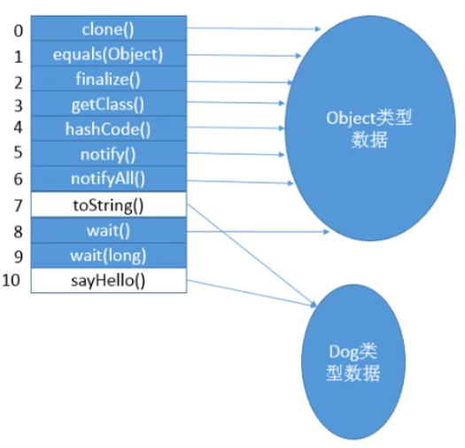

**CockerSpaniel的虚方法表**

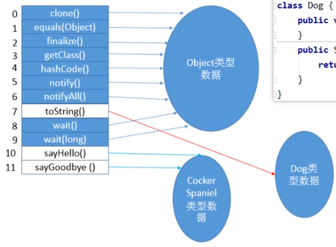


**cat的虚方法表**

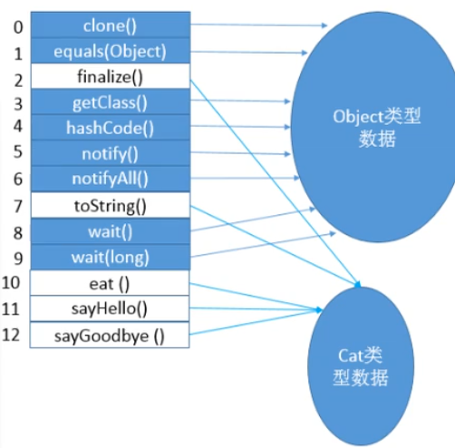


##### ④ 方法返回地址(Return Address)

- 存放调用该方法的**pc寄存器**的值（存放该方法要执行的下一条指令的值 ）。
- 一个方法的结束，有两种方式：
  - 正常执行完成
  - 出现未处理的异常，非正常退出
- 无论通过哪种方式退出，在方法退出后都返回到该方法被调用的位置。方法正常退出时，**调用者的pc计数器作为返回地址**，即调用该方法的指令的下一条指令的地址。而通过异常退出的，返回地址是要通过**异常表**来确定，栈帧中一般不会保存这部分信息。

正常完成出口：

- 一个方法在正常调用完成之后究竟需要使用哪一个返回指令还需要根据方法返回值的实际数据类型而定。
- 在字节码指令中，返回指令包含ireturn（当返回值是boolean、byte、char、short和int类型时使用）、lreturn、freturn、dreturn以及areturn，另外还有一个return指令供声明为void的方法、实例初始化方法、类和接口的初始化方法使用。

异常处理表：

```shell
  Exception table:
     from    to  target type
         4     8    11   Class java/io/IOException
```


##### ⑤ 一些附加信息

栈帧中还允许携带与Java虚拟机实现相关的一些附加信息。例如，对程序调试提供支持的信息。


#### 6）栈的相关面试题

- 举例栈溢出的情况？(StackOverflowError)
  - 通过-Xss设置栈的大小：内存不足会出现OOM
- 调整栈大小，就能保证不出现溢出吗？(不能保证）
  - 但对于正常的非永久性递归时运行次数过大，可以通过调整栈大小来使可增大其递归运行次数)
- 分配的栈内存越大越好吗？(不是)
  - 整个内存是有限的，过大的内存会挤占其他进程空间。
- 垃圾回收是否会涉及到虚拟机栈？(不会)
  - 程序计数器不存在Error也没有GC。
  - 虚拟机栈存在Error不存在GC。
  - 本地方法栈存在Error不存在GC。
  - 堆存在Error存在GC。
  - 方法区存在Error也存在GC
- 方法中定义的局部变量是否线程安全？
  - 如果方法中定义的是基本类型或者在方法中开辟的引用类型并在方法中消亡，就是线程安全的。（内部产生且在内部消亡）
  - 如果方法中定义的是传入方法引用的形参引用地址类型，线程不安全。（非内部产生）
  - 如果方法中新开辟引用类型并传出方法外，线程不安全。（内部产生但返回出去了）

